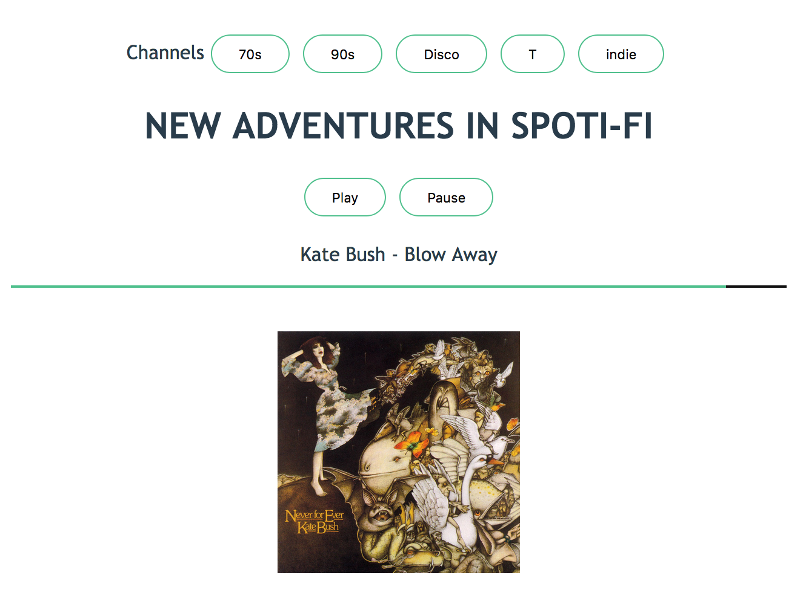

# Robin

### Spotify controls in Elm



An example deployment can be found at [jovial-carson-5f0011.netlify.com](http://jovial-carson-5f0011.netlify.com).

Robin was written as an exercise to learn more about Elm and integrating with external services.
It uses the Spotify API to control the user's currently active Spotify player,
be that on their laptop, phone, Chromecast etc. This is done with the Elm HTTP 
library and the standard JSON decoders. Users can sign in with a Google account
to claim a "channel" that they control and any other user can listen to.

The channels are backed by Firebase's [Cloud Firestore](https://firebase.google.com/docs/firestore/)
acting as both persistence and a simple broadcasting message service.
This was a opportunity to use Elm ports to communicate with the Firebase JS
running outside the Elm runtime. Without the guarantees of the Elm type
system this bit of code became the most brittle. It follows the "Outside Info" pattern
described by Murphy Randle in his [2017 elm-conf talk](https://www.youtube.com/watch?v=P3pL85n9_5s).


## Setup

To run this project you require Spotify and Firebase API keys,
they should be setup in env vars as follows:
```
ELM_APP_SPOTIFY_CLIENT_ID=
ELM_APP_SITE_URI=http://localhost:3000
ELM_APP_FIREBASE_API_KEY=
ELM_APP_FIREBASE_AUTH_DOMAIN=
ELM_APP_FIREBASE_PROJECT_ID=
```

Once the environment is set and Elm is installed you can install dependencies with:
```
elm-app install
```

And start the app with:
```
elm-app start
```
